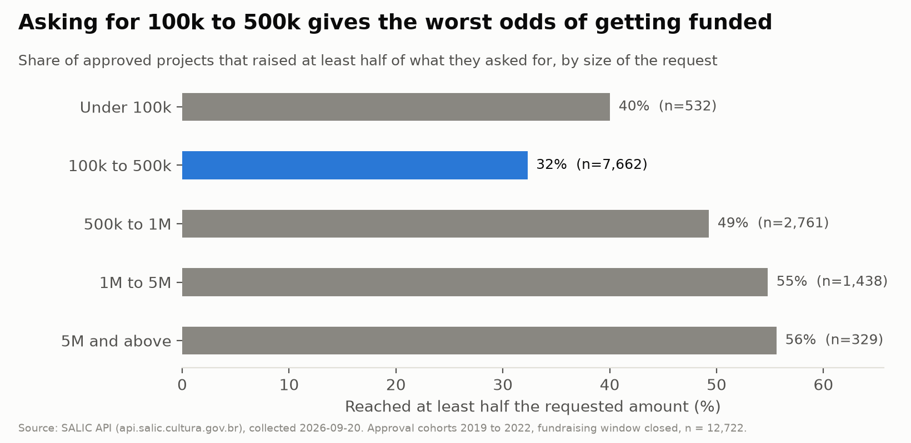
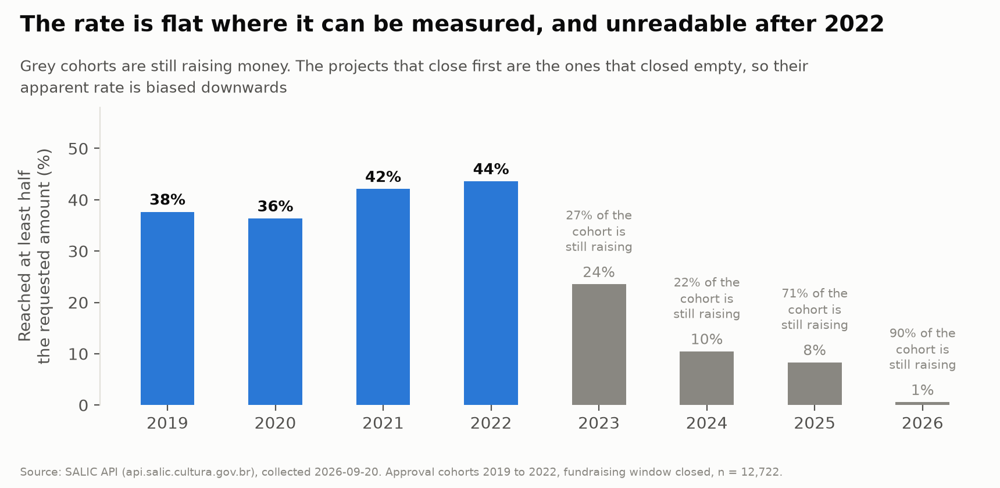

# Approved is not funded

**How likely is an approved Rouanet project to actually raise the money? Of 12,722
approved projects whose fundraising window has closed, exactly half raised nothing at
all, and only 39.5% reached half of what they asked for.**

Brazil's Rouanet Law works in two steps. The Ministry of Culture approves a project and
an amount, and that approval brings no money: it gives the producer permission to go and
find sponsors who redirect part of their income tax into the project. This repository
measures what happens in the second step, and asks whether anything knowable at approval
predicts it.



## What the data says

**1. Half of approved projects raise nothing.** Not "less than they hoped": zero. Of the
12,722 approved projects from cohorts 2019 to 2022 whose window has closed, 6,357 never
received a single contribution. Across the whole sample, 53.5% of the money requested
was actually raised, but that total hides the split: a minority of projects raise most
of what they asked for and the rest raise nothing.

**2. The worst budget to ask for is 100k to 500k reais.** Projects requesting that range
reach half their target 32.3% of the time, against 40.0% for projects under 100k and
55.6% for projects above 5M. The relationship is not "smaller is easier". Large projects
come with sponsors already attached, very small ones are cheap to fill, and the band in
the middle is where most projects sit (7,662 of 12,722) and where they fail most.

**3. Where you are matters more than what you do.** By area the rates run from 36.7%
(Humanidades) to 56.0% (Museus e Memoria). By state they run from 15.3% in Goias and
17.6% in the Federal District to 50.2% in Ceara and 49.9% in Santa Catarina, a spread
more than three times wider than the spread across artistic areas.

**4. The money is extraordinarily concentrated.** The top 10% of proponents took 67% to
80% of everything raised, depending on the cohort, with a Gini between 0.80 and 0.89. On
the sponsor side it is more extreme still: across all 113,757 sponsors the API records,
the top 10% account for 98.4% of the R$ 35.6 billion donated and the top 1% for 81.5%,
a Gini of 0.981. 90,276 of those sponsors are individuals and together they contribute
1.9% of the money. This is a corporate tax mechanism with a long tail of private donors
attached.

**5. The rate has been flat since 2019, and anything that looks like a recent collapse
is an artefact.** Cohorts 2019 to 2022 sit between 36% and 44%. Later cohorts appear to
fall off a cliff, but 22% to 90% of each is still raising money, and the projects that
close first are the ones that closed empty.



## Does a model beat a simple rule?

No, and that is the result.

The comparison is against the rule a producer could apply unaided: the historical rate
for their segment in their state. Trained on cohorts 2019 to 2021 and scored once on
2022:

| Model | PR-AUC | Brier | Lift, top decile |
| --- | --- | --- | --- |
| Logistic regression | 0.580 | 0.349 | 1.47 |
| LightGBM | 0.539 | 0.340 | 1.40 |
| Heuristic: segment and state rate | 0.530 | **0.235** | 1.31 |
| Majority class | 0.437 | 0.249 | 0.92 |

The model gains 0.05 of PR-AUC over the heuristic and gives up 0.11 of Brier score. It
orders projects sensibly and prices them badly: on the held out cohort it predicts a
mean probability of 0.767 where 0.437 happened. For a tool whose output is a
probability, that is a loss, so the app leads with the historical rate and shows the
model second with the problem stated next to it.

The cause is in `docs/model_card.md`: the proponent history features drift as the
observation window lengthens, so the feature means something different in 2022 than it
meant in 2020.

### The leak that had to be found first

The first version of this model scored PR-AUC 0.85, which was too good. Permutation
importance showed one feature worth 0.271 against 0.012 for the next: the ratio of the
approved amount to the requested amount.

`valor_aprovado` is revised downwards during the accounting phase to match what was
actually raised. It is revised for 31.7% of projects that raised money and 1.3% of those
that did not. So a share of the approved amount is partly a function of its own
numerator. The target now uses the **requested** amount as its denominator, and the
approved amount is excluded from the features entirely. The headline barely moved (39.9%
to 39.5%); the model's apparent skill collapsed, correctly. Full evidence in
`docs/data_dictionary.md`.

## Limitations

- **The data starts in 2019.** The API exposes no approval cohort before it: every year
  from 1993 to 2018 returns `message_code 11`. This is not the history of the law.
- **Only four cohorts are usable**, because everything from 2023 on is still raising.
  That makes the temporal split thin, and it puts the pandemic years inside the training
  data, so a pandemic effect and a cohort effect cannot be separated.
- **The decisive variable is missing.** Whether a producer already has a sponsor lined
  up is what determines most of this, and it is nowhere in the public data.
- **Sponsor concentration has no time dimension.** `total_doado` is a lifetime total, so
  those figures are a cross section over all recorded history, not the 2019 to 2022
  window. A per year series would need the donations endpoint for all 113,757 sponsors.
- **309 projects were excluded** whose status reads as an evaluation step although their
  window has long passed. They reach 50% at 55.7% against 39.9% for the sample kept, so
  the exclusion lowers the headline slightly. Recorded in `docs/cleaning_log.md`.
- **Association, not cause.** Nothing here says that moving your budget out of the 100k
  to 500k band changes your odds.

## Reproducing this

```bash
make setup      # virtualenv and pinned dependencies
make collect    # ~1,800 pages from the SALIC API into data/raw (slow, resumable)
make all        # everything downstream: interim, quality, processed, model, figures
```

`make collect` is separate from `make all` on purpose: it hits a public API a few
thousand times and is not something to trigger by accident. It is resumable, so an
interrupted run continues where it stopped.

Run the app locally with `.venv/bin/streamlit run app/streamlit_app.py`. It reads a
small committed artefact in `app/data/` rather than `data/`, so it deploys to Streamlit
Community Cloud from the repository alone.

## Layout

| Path | What is in it |
| --- | --- |
| `src/` | Collector, parsing, quality checks, features, models, figures |
| `sql/` | One DuckDB query per sub-question |
| `notebooks/` | Collection, exploration, modelling, error analysis |
| `app/` | Streamlit app and the aggregate artefact it reads |
| `docs/` | Brief, data dictionary, cleaning log, model card |
| `reports/` | Quality report, error analysis, model results, figures |
| `data/` | Untracked. Raw pages are immutable; everything else is rebuilt by `make` |

## Data and privacy

Source: [SALIC API](https://api.salic.cultura.gov.br/docs), open and unauthenticated,
collected 2026-09-20. Raw pages contain CPF and CNPJ and are never committed. Proponents
and sponsors are carried downstream only as a salted hash, the salt is generated per
checkout and is not committed, and the artefact the app reads contains no identifier of
any kind.
